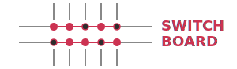

<p align="center">
  
</p>

A terminal dashboard for starting, stopping, and monitoring local dev servers.

```
 SWITCHBOARD

 MY APP
 ╔══════════════════════════════════╗  ╭──────────────────────────────────╮
 ║ API                  ● running   ║  │ Web                   ● running  │
 ║ bun dev                          ║  │ npm run dev                      │
 ║ :3001  2h 14m                    ║  │ :3000  2h 14m                    │
 ║ 48MB ████░░░░░░      cpu 2.1%    ║  │ 112MB ██░░░░░░░░     cpu 0.3%    │
 ╚══════════════════════════════════╝  ╰──────────────────────────────────╯

 TOOLS
 ╭──────────────────────────────────╮
 │ Portless              ● running  │
 │ portless proxy start             │
 │ :443  5h 02m                     │
 │ 12MB █░░░░░░░░░       cpu 0.1%   │
 ╰──────────────────────────────────╯
```

## Quick Start

```bash
bun install
bun run dev        # run from source
```

### Build Executable

```bash
bun run build      # creates ./switchboard binary
./switchboard
```

## Config

Servers are defined in `~/.config/switchboard/apps.yaml`:

```yaml
groups:
  - name: My App
    servers:
      - name: API
        dir: ~/workspace/apps/my-app/api
        cmd: bun dev
        port: 3001
      - name: Web
        dir: ~/workspace/apps/my-app/web
        cmd: npm run dev
        port: 3000

  - name: Tools
    servers:
      - name: Proxy
        cmd: my-proxy start
        stopCmd: my-proxy stop
        port: 443
        sudo: "-E"
```

### Server Fields

| Field | Required | Description |
|-------|----------|-------------|
| `name` | Yes | Display name |
| `cmd` | Yes | Start command |
| `dir` | No | Working directory (`~` is expanded) |
| `port` | No | Port number (shown in card, used for status detection) |
| `sudo` | No | Sudo flags (e.g. `"-E"`, `true`). `-S` and `-k` are added automatically |
| `stopCmd` | No | Stop command for daemon-style servers |
| `pidFile` | No | PID file path for tracking daemon processes |

## Keybindings

### Dashboard

| Key | Action |
|-----|--------|
| `↑↓←→` | Navigate between server cards |
| `s` | Start selected server |
| `x` | Stop selected server |
| `r` | Restart selected server |
| `l` | View server logs |
| `S` / `X` | Start / stop all servers in group |
| `a` | Add new server |
| `e` | Edit selected server |
| `d` | Delete selected server |
| `Ctrl+L` | Force screen redraw |
| `q` | Quit (servers keep running) |

### Log Viewer

| Key | Action |
|-----|--------|
| `↑↓` | Scroll |
| `f` | Toggle follow mode |
| `/` | Search |
| `esc` | Back to dashboard |

## Server Types

**Foreground servers** (e.g. `bun dev`) — the dashboard spawns and owns the process. Logs are captured. Stop kills the process tree.

**Background daemons** (e.g. portless) — the start command launches a daemon and exits. Status is detected via port probing. Stop runs the `stopCmd`. Configure `port` for status detection and `stopCmd` for clean shutdown.

## Behavior

- Servers keep running when you quit (`q`). The dashboard re-attaches on next launch.
- Running PIDs are saved to `~/.config/switchboard/state.json` every 3 seconds.
- Multiple dashboard instances can detect each other's servers.
- Sudo password is prompted inline. Credentials are never cached (`-k` flag).

## Stack

[pi-tui](https://github.com/badlogic/pi-mono) + [Yoga](https://www.yogalayout.dev/) for terminal rendering, Bun for runtime and process management.
